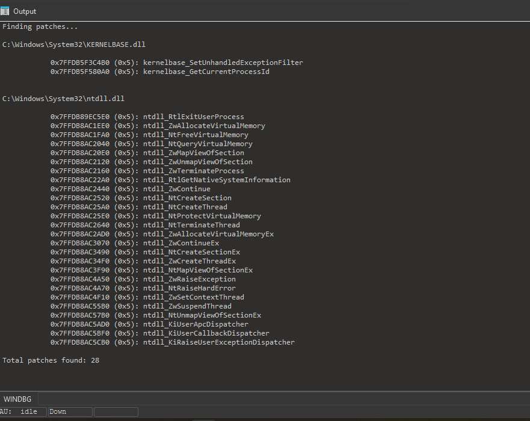

# Patch Finder IDA Plugin

An IDA Pro plugin to detect patched code during debugging sessions.  
It detectes patches and hooks by scanning executable memory regions and comparing the data to the files on disk.

Currently only works with PE files!

Download it [here](https://github.com/momo5502/patch-finder/actions?query=branch%3Amain), from GitHub actions.  
Click [here](https://youtu.be/xpRAqWmnmZc) to see a demo.

